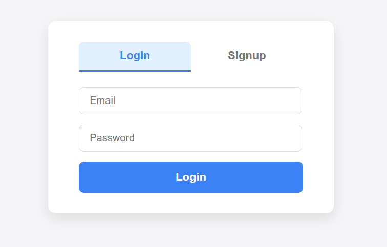

# 🔐 React Login & Signup App

A simple and responsive authentication UI built using React. This project includes login and signup functionality with form validation and mock authentication logic.
---

## 📸 Screenshot



---
## 🚀 Features

- ✅ Email & Password Authentication (Mocked)
- 🧠 Form Validation for Input Fields
- ⚛️ React Hooks (`useState`, `useEffect`)
- 💅 Clean and Mobile-Responsive UI

## 🛠️ Tech Stack

- React
- HTML5 & CSS3
- JavaScript (ES6)

## 📁 Project Structure

```
src/
├─ components/
│  ├─ Login.js
│  ├─ Signup.js
├─ styles/
│  └─ App.css
├─ App.js
├─ index.js
public/
├─ index.html
.gitignore
package.json
README.md 
```
